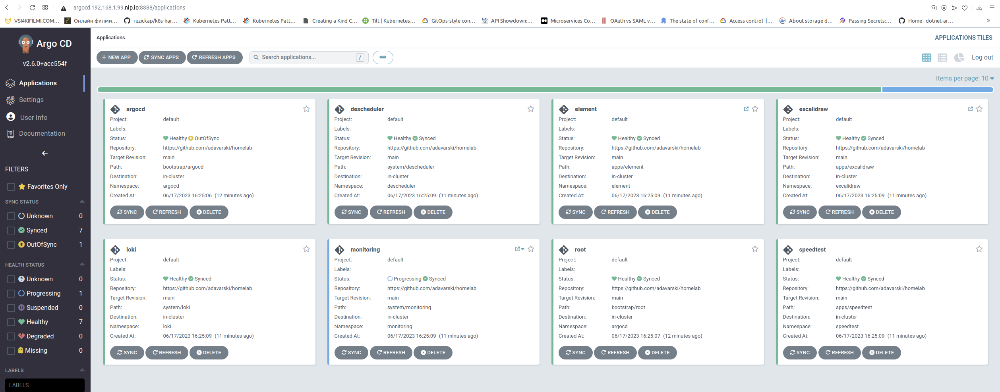

# Homelab Development Environment

Fully automated Kubernetes and GitOps setup to host my important services at home.

Read the [docs](https://adavarski.github.io/homelab) for technical details.

## Hardware

HP Workstation:
- CPU: `8 x Intel(R) Core(TM) i5-8265U CPU @ 1.60GHz`
- RAM: `16GB`
- SSD: `512GB`

## Getting Started

Clone the repository

```sh
git clone https://github.com/adavarski/homelab
```

## Dependencies

=== "Generic"

    - Homelab
        - [kubectl](https://kubernetes.io/docs/tasks/tools/#kubectl)
        - [Go Task](https://taskfile.dev/installation)
        - [k3d](https://k3d.io/#installation) (only needed for development)

    - Docs
        - Install [Material for MkDocs](https://squidfunk.github.io/mkdocs-material/getting-started/#latest) including [image processing dependencies](https://squidfunk.github.io/mkdocs-material/setup/dependencies/image-processing)

```
### Install Go Task example ( task is like GNU make, but better)
$ sudo sh -c "$(curl --location https://taskfile.dev/install.sh)" -- -d -b /usr/local/bin
$ task --list-all
task: Available tasks for this project:
* bootstrap:                           
* dev:                                 
* dev:cleanup:                         
* scripts:argocd-admin-password: 
```

## Develop

### Bootstrap

Run the task `dev` to fully bootstrap the development environment.

```bash
task dev
```

After waiting ~5 minutes you should be able to reach the hosted services at `https://*.192.168.1.99.nip.io`, for example at [http://argocd.127-0-0-1.nip.io](https://argocd.127-0-0-1.nip.io).

Warning "Caveats"

    - No persistent storage

### Explore

Get access to secrets by using some task scripts:

```bash
task scripts:argocd-admin-password
```

## Clean up

Run the task `dev:cleanup` to clean up (delete the local test Kubernetes cluster)

```bash
task dev:cleanup
```

## Screenshots

Browser: http://argocd.192.168.1.99.nip.io:8888

| ArgoCD |
| :--: |
|  |


## Apps

<table>
    <tr>
        <th>Logo</th> <th>Name</th> <th>Description</th>
    </tr>
    <tr>
        <td>
        <td><a href="https://docs.excalidraw.com">Excalidraw</a></td>
        <td>Online whiteboard</td>
    </tr>
</table>
