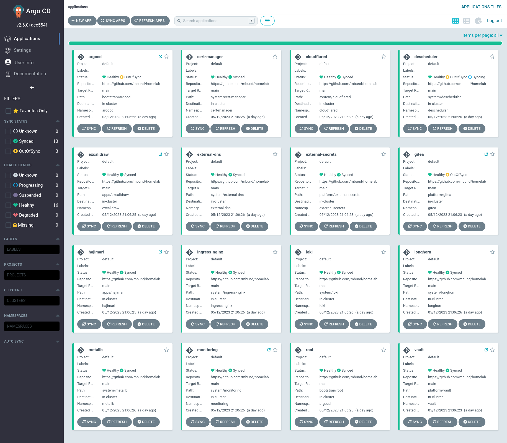
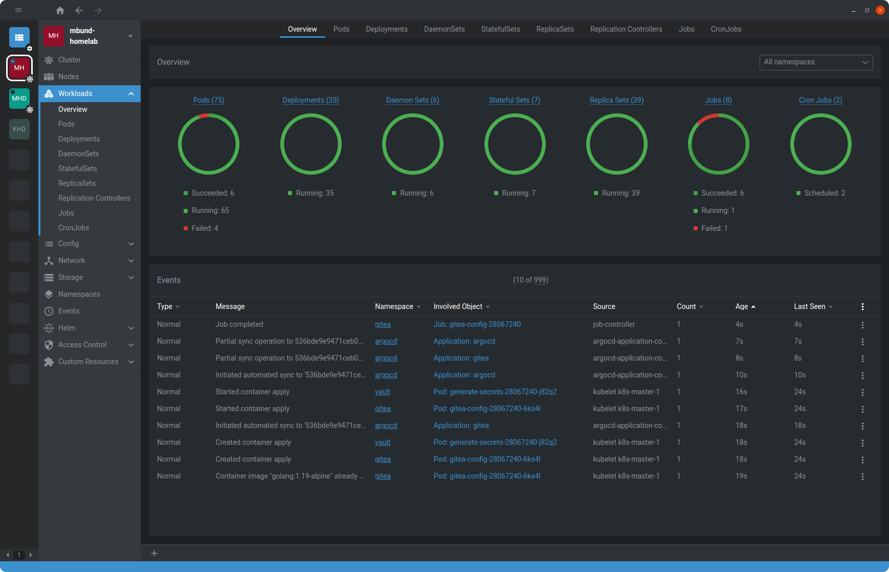

# Adavarski Homelab:

Fully automated Kubernetes and GitOps setup to host my important services at home.

Read the [docs](https://adavarski.github.io/homelab) for technical details.

## Hardware

HP Workstation:
- CPU: `8 x Intel(R) Core(TM) i5-8265U CPU @ 1.60GHz`
- RAM: `16GB`
- SSD: `128GB`
- HDD: `1TB`

### Install needed apps:
- kubectl
- [go-task](https://taskfile.dev/installation/)
- k3d
- helm

```
### install tasks (like GNU make)
$ sudo sh -c "$(curl --location https://taskfile.dev/install.sh)" -- -d -b /usr/local/bin
$ task --list-all
task: Available tasks for this project:
* bootstrap:                           
* dev:                                 
* dev:cleanup:                         
* scripts:argocd-admin-password: 
```

## Screenshots

| ArgoCD |
| :--: |
|  |

| Lens |
| :--: |
|  |

## Apps

<table>
    <tr>
        <th>Logo</th> <th>Name</th> <th>Description</th>
    </tr>
    <tr>
        <td>
        <td><a href="https://docs.excalidraw.com">Excalidraw</a></td>
        <td>Online whiteboard</td>
    </tr>
</table>
